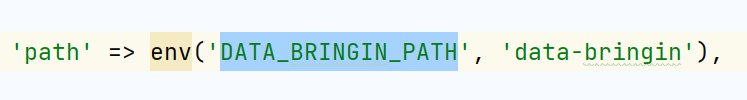

# Laravel Data Bringin

## Introduction

This package provides an easy and flexible way to import  CSV files to a Laravel application's database.
With this package, you can define your import mappings, which allows you to map columns in your CSV files to specific fields in your database tables.

## Installation & Usage

> **Requires [PHP 8.0+](https://php.net/releases/) | [Laravel 8.0+](https://laravel.com/docs/8.x)**

Require Laravel Data Bringin using [Composer](https://getcomposer.org):

```bash
composer require vcian/laravel-data-bringin
```
## Usage:

You can access Data Brigin view via below route

**Access Route:** http://yourdomain.com/data-bringin


**Note:**

1) Don't forget to replace your actual domain with "yourdomain.com"

2) You can also update your custom route with config/data-brigin.php


3) By default, data-bringin support import data upto **10,000** records.
If you want to upgrade more capacity than you have to make changes in php.ini file below parameter values. 


    max_execution_time
    post_max_size
    memory_limit
    max_input_vars


## Changelog

Please see [CHANGELOG](CHANGELOG.md) for more information what has changed recently.

## Contributing

Please see [CONTRIBUTING](CONTRIBUTING.md) for details.

## Security

If you discover any security-related issues, please email ruchit.patel@viitor.cloud instead of using the issue tracker.

## Credits

- [All Contributors](../../contributors)

## License

The MIT License (MIT). Please see [License File](LICENSE.md) for more information.
